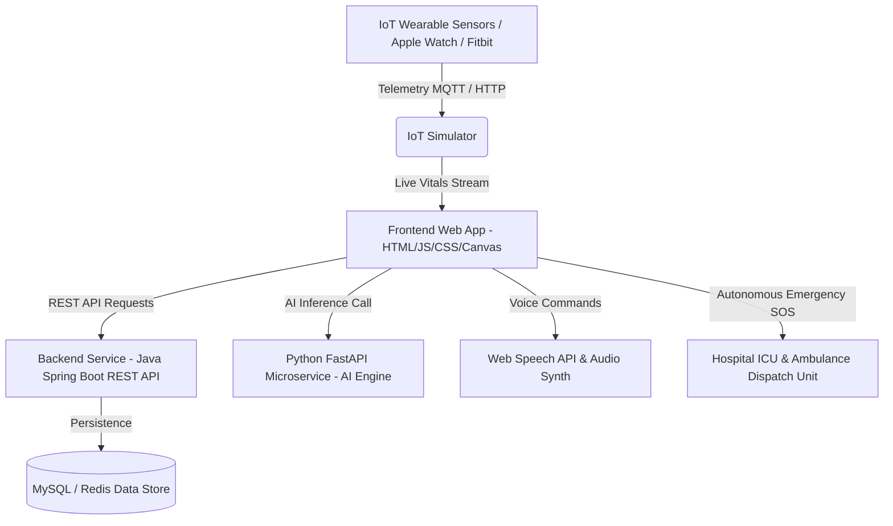

# AI Smart Health Monitoring & Emergency Response System (HealthGuardian AI)

> **"Real-Time AI Health Monitoring for Saving Lives"**

An enterprise-grade, full-stack healthcare telemetry and automated emergency response platform. Designed with ultra-modern dark glassmorphism UI, zero-dependency Web Audio API sound synthesis, 3D WebGL Web biometrics mesh, real-time ambulance dispatch tracking, multi-role hospital management, AI disease diagnostic neural models, and wearable IoT sensor integration.

---

## 🌟 Executive Key Features

- **Futuristic UI & Micro-Animations**: Built with a sleek dark glassmorphism palette, neon accents, floating canvas particles, 3D biometric DNA mesh, and real-time ECG waveform canvas.
- **9 Role-Based Dashboards & Interfaces**:
  1. **Landing Page**: Watch Demo modal, Live Health Status Counter (148,290+ Patients Protected, 99.4% AI Accuracy, 1,450+ Hospitals), feature grid, and trusted healthcare partners.
  2. **Patient Dashboard**: 8 vital cards (Heart Rate, Blood Pressure, SpO2, Temperature, Respiration, Glucose, BMI, Stress), Radial Health Index ring, 24-hr vital trend graphs, and prescribed medicine reminders.
  3. **AI Neural Diagnostics Engine**: Real-time neural network node visualizer, disease probability calculator analyzing **16 health conditions** (Heart Disease, Diabetes, Stroke, High BP, Low BP, Asthma, COVID-19, Anxiety, Depression, Kidney/Liver problems, Fever, Dehydration, Sleep Disorders), and custom dietary/exercise recommendations.
  4. **Emergency SOS System**: Synthesized high-intensity medical siren, emergency countdown clock, automated ICU trauma center locator, instant doctor/family notification, and printable dispatch PDF reports.
  5. **Hospital Module**: Live bed tracking (ICU, Emergency, General), Operation Theatre (OT) monitor, available doctors call board, Blood Bank stock, and emergency request queue with bed reservation workflows.
  6. **Ambulance Live Tracking Map**: Interactive SVG/Canvas map rendering real-time animated ambulance location along optimized traffic routes, ETA, speed, and continuous telemetry broadcast to hospital.
  7. **Doctor Command Center**: Clinical patient triage roster with search filtering, Add Patient Telemetry form, Digital Prescription Builder, and Tele-consultation video window.
  8. **Family Dashboard**: Loved ones live health monitoring, geofence safety alerts, doctor check-in feeds, and emergency speed dial.
  9. **Admin & System Analytics**: Enterprise user management, onboarded hospital statistics, AI model telemetry logs, and Chart.js analytics pie/bar charts.
- **AI Chatbot & Speech Voice Assistant**: Floating AI assistant with Web Speech API voice command listener ("Help me", "Call ambulance"), symptom advisor, and Web Speech Synthesis (Text-to-Speech).
- **IoT Wearable Simulator**: Apple Watch, Fitbit, Smart Band, Bluetooth ECG sensor connection status with live telemetry streaming toggle.

---

## 🏗️ System Architecture



---

## 🛠️ Technology Stack

### Frontend
- **HTML5 & Vanilla JavaScript (ES6+)**: High performance, zero framework overhead.
- **CSS3 / Glassmorphism Design System**: Custom variables, responsive grid, neon glow effects, dark medical palette.
- **Chart.js**: Animated line, pie, bar, and radar charts.
- **HTML5 Canvas / WebGL Graphics**: Dynamic particles, 3D DNA helix mesh, live ECG waveforms, interactive emergency map.
- **Browser Web Audio API**: Synthesized heartbeat sound FX and high-intensity emergency sirens.
- **Web Speech API**: Speech Recognition (Voice command input) & Speech Synthesis (TTS voice responses).

### Backend
- **Java 17 Spring Boot**: RESTful APIs, Spring Security with JWT RBAC, Spring Data JPA/Hibernate.
- **Maven**: Build and dependency management.

### AI Engine & IoT Simulator
- **Python 3.10 + FastAPI**: Async microservice for neural network inference and disease risk scoring.
- **NumPy, Pandas, Scikit-learn**: Predictive diagnostic modeling.
- **Python Telemetry Simulator**: Synthetic biometrics generator simulating realistic bio-noise.

---

## 🚀 Quickstart & Installation

### 1. Running Frontend Locally
Open `frontend/index.html` directly in any modern Web Browser (Chrome, Edge, Firefox, Safari) or serve with Live Server:
```bash
cd frontend
# Using Python simple HTTP server
python -m http.server 8000
```
Then navigate to `http://localhost:8000`.

### 2. Running Java Spring Boot Backend
```bash
cd backend
./mvnw spring-boot:run
```
REST APIs will be accessible at `http://localhost:8081`.

### 3. Running Python AI Microservice
```bash
cd ai-engine
pip install -r requirements.txt
python main.py
```
FastAPI documentation available at `http://localhost:8000/docs`.

### 4. Running Docker Compose Setup
```bash
docker-compose up --build
```

---

## 📁 Repository Directory Structure

```
├── frontend/
│   ├── css/
│   │   └── healthguardian-theme.css   # Complete Glassmorphism Design Token System
│   ├── js/
│   │   ├── ai-engine.js               # Neural Network Diagnostic Logic & 16-Disease Risk Matrix
│   │   ├── audio-synth.js             # Web Audio API Siren, Heartbeat & TTS Synthesizer
│   │   └── three-scene.js             # WebGL Particles, 3D DNA Mesh & Emergency Map Canvas
│   └── index.html                     # Main Single Page App (9 Complete Views & Modals)
├── backend/
│   ├── src/main/java/com/health/healthmonitor/
│   │   ├── controller/                # REST Controllers (Patient, Doctor, Hospital, Emergency, AI)
│   │   └── model/                     # JPA Entities (Patient, Doctor, Hospital, EmergencyAlert)
│   └── pom.xml                        # Spring Boot Maven Dependencies
├── ai-engine/
│   ├── main.py                        # Python FastAPI Diagnostic Inference Server
│   └── requirements.txt               # Dependencies
├── iot-simulator/
│   └── sensor_sim.py                  # Wearable Biometrics Simulator
├── docker-compose.yml                 # Multi-Container Deployment Config
└── README.md                          # Project Documentation
```

---

## 🛡️ License & Credits

Developed with excellence for advanced AI health monitoring and real-time emergency triage.